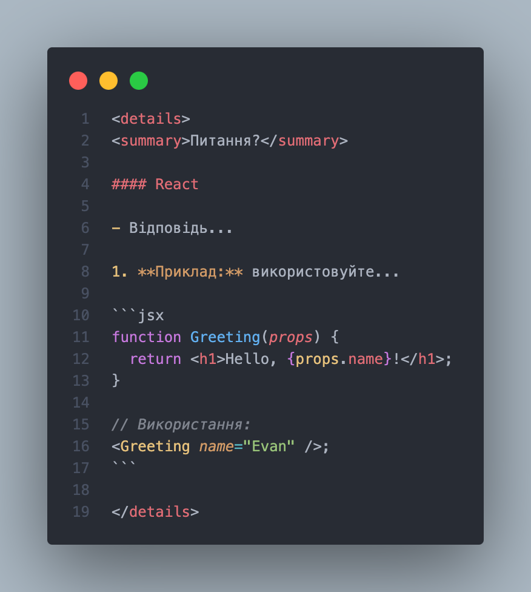

# 🧠 Як зробити внесок у Frontend Lovers

Дякуємо, що хочете зробити внесок у наш проєкт! Нижче описано кілька простих правил, які допоможуть вам підготувати якісний pull request.

## 🔧 Формат доповнення

- Кожне питання повинне бути оформлене в HTML-елементі `<details>` зі структурою:



<details>
<summary>Питання?</summary>

#### React

- Відповідь...

1. **Приклад:** використовуйте...

```jsx
function Greeting(props) {
  return <h1>Hello, {props.name}!</h1>;
}

// Використання:
<Greeting name="Evan" />;
```

</details>
